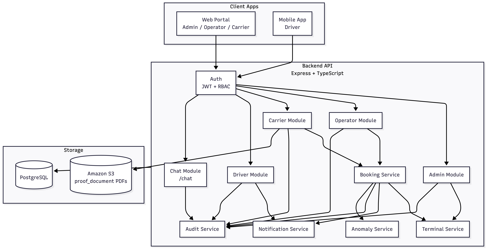

# PRD — Port Booking Backend (MVP)

## 1. Summary
The MVP is a role-based backend for managing port terminal bookings. It supports admins, operators, carriers, and drivers, with core workflows for registration, approval, booking creation, and confirmation.

## 2. Goals
- Enable carriers to register and request bookings at terminals.
- Allow admins to manage terminals, carriers, and operators.
- Allow operators to approve/reject bookings and view dashboards.
- Allow drivers to view assigned bookings, QR codes, and notifications.
- Provide audit logging and anomaly visibility.
- Strengthen carrier onboarding with secure business-document verification (`proof_document` PDF) stored in S3.

## 3. Non-Goals (MVP)
- Payments or billing.
- Real-time tracking / live location.
- Complex scheduling or recurring bookings.
- Public-facing terminal availability API.
- Multi-language content management.

## 4. Users & Roles
- ADMIN: system owner; manages terminals, carriers, operators; sees full dashboards.
- OPERATOR: operational staff; approves/rejects bookings; sees dashboards and terminal stats.
- CARRIER: transport company; registers; manages drivers; creates bookings.
- DRIVER: assigned to bookings; views own bookings and QR codes.

## 5. Core Entities (Data Model)
- User (role, email, password, isActive)
- CarrierProfile
- OperatorProfile
- DriverProfile
- Terminal (status, slots)
- Booking (status, terminal, carrier, driver)
- Notification (for drivers)
- AuditLog (actions)
- Anomaly (system anomalies)

## 6. MVP Functional Requirements

### Auth
- Login via `POST /auth/login` returning JWT + role.

### Admin
- Create operators.
- CRUD terminals.
- View and update carriers (including approve/reject).
- View carrier drivers.
- View dashboard overview stats.

### Operator
- List bookings (with status filter).
- Approve/reject bookings (adjust slots and notify driver).
- View bookings for a given carrier.
- View terminals and terminal details.
- View dashboard overview stats.

### Carrier
- Register (creates user + profile) with required `proof_document` PDF upload.
- Manage drivers (CRUD).
- Create bookings (requires carrier approval).
- View, update, delete own bookings (only while PENDING).
- View terminals list (id + name only).

### Driver
- View own bookings.
- View booking QR.
- View and mark notifications as read.

### Anomalies
- Admin/Operator can view anomalies list.

## 7. Booking Flow (MVP)
1. Carrier registers.
2. Admin approves carrier.
3. Carrier creates driver.
4. Carrier creates booking (PENDING).
5. Operator approves or rejects booking.
6. If approved: terminal slots decrease; driver gets notification.
7. Driver views booking and QR.

## 7.1 Carrier Business Document Verification (S3)
- At carrier registration, the user must upload a business proof document (`proof_document`, PDF only).
- The backend receives the multipart file, validates MIME type and size, uploads to Amazon S3, and stores only the file URL in `carrier_profiles.proof_document_url`.
- New carrier status stays `PENDING` until admin review of the uploaded document.
- Admin can approve (`APPROVED`) or reject (`REJECTED`) based on document verification.

Why add S3 for this:
- Better security than local disk: no persistent file storage on app servers or containers.
- Better verification workflow: a stable document URL is available to admins during review.
- Better access control: IAM, bucket policy, and optional CloudFront control who can access files.
- Better reliability: S3 is durable and avoids losing verification files during app redeploys.
- Cleaner database design: DB stores only metadata/URL, not binary file payloads.

## 7.5. AI-Powered Request Processing Pipeline

The system uses an advanced multi-agent AI architecture to intelligently process and execute user requests across all roles. This enables natural language interaction while maintaining strict data governance and role-based confidentiality.

### Workflow Overview (6-Step Pipeline)

**Step 1: Input Sanitization**
- Apply comprehensive input pattern validation and sanitization.
- Filter out malicious payloads, SQL injection attempts, and prompt injections.
- Normalize input format (trimming, case handling, special character encoding).
- Flag suspicious patterns for audit logging.

**Step 2: Intent Classification & Entity Extraction**
- Classify user requests into actionable intents: `bookings`, `slots_availability`, or `unknown`.
- Extract relevant entities:
  - Terminal identifiers (ID, name, location)
  - Booking IDs, dates, time windows
  - Carrier/driver profiles, status filters
  - Natural language queries converted to structured parameters
- Assign confidence scores to each classification.
- Identify if user clarification is required before proceeding.

**Step 3: Task Decomposition & Execution Planning**
- Break user intent into explicit sub-tasks with clear dependencies.
- Map sub-tasks to appropriate backend API endpoints and specialized agents.
- Create ordered execution plan respecting data dependencies.
- Define expected inputs/outputs for each task (validation schemas).
- Optimize execution order for performance and consistency.

**Step 4: Multi-Agent Task Execution**
- Route tasks to specialized sub-agents:
  - **Booking Agent**: Handles booking creation, updates, and queries.
  - **Slots Availability Agent**: Manages terminal slot availability and scheduling logic.
  - **Data Retrieval Agent**: Fetches and aggregates required data from database.
- Execute agents in parallel where dependencies allow.
- Aggregate responses from multiple agents with conflict resolution.
- Capture execution metrics and failures for debugging.

**Step 5: Response Synthesis & Role-Appropriate Formatting**
- Synthesize agent responses into contextually relevant outputs.
- **For Carriers/Drivers**: Concise natural language responses with actionable next steps.
- **For Operators/Admins**: Structured JSON payloads optimized for dashboard integration, including:
  - Summary statistics and key metrics
  - Detailed records with filterable fields
  - Anomaly flags and warnings
  - Audit trail snippets
- Adapt verbosity and detail level based on user role and request context.

**Step 6: Output Validation & Confidentiality Enforcement**
- Final guardrail pass to detect and prevent information leakage.
- Redact or omit sensitive fields based on role:
  - Hide driver contact details from operators (except assigned bookings).
  - Mask carrier financial or pricing information from competitors.
  - Filter anomaly details based on security level.
- Enforce row-level security: users only see data within their role scope.
- Log all output transformations for compliance audits.

### Key Features
- **Robustness**: Fallback to structured queries if NLP confidence is low.
- **Auditability**: Every request, classification, and output transformation is logged.
- **Scalability**: Stateless agents designed for horizontal scaling.
- **Security**: End-to-end validation with no raw user input exposed to agents.

## 8. Status & Rules
- Carrier must be APPROVED to create drivers or bookings.
- Booking can be updated/deleted only when status is PENDING.
- Terminal slot availability enforced on booking approval.

## 9. API Surface (MVP)
See `ROUTES.md`, `API.md`, and `HowtoTestRoutes.md` for endpoint list and payloads.

## 10. Security
- JWT auth for protected endpoints.
- Role-based access control (ADMIN/OPERATOR/CARRIER/DRIVER).
- Basic validation via zod.
- Upload security for carrier proof documents:
  - accept only `application/pdf`
  - enforce max file size (example: 5MB)
  - generate safe unique S3 object keys (no unsafe raw filenames)
  - store only S3 URL in DB (`proof_document_url`)
  - keep carrier `PENDING` until admin validation of document métier

## 11. Observability
- Audit logs for key actions.
- Anomalies endpoint for admin/operator.

## 12. MVP Success Metrics
- Carriers can register, be approved, and create bookings end-to-end.
- Operators can approve bookings and manage terminal capacity.
- Drivers can log in and retrieve assigned bookings and QR.

## 13. Future Enhancements
- Public terminal availability endpoint.
- Advanced booking conflict checks.
- Booking cancellation and consumption workflow.
- Reporting exports (CSV/PDF).
- Webhooks or email/SMS notifications.

## 14. System Architecture Diagram

